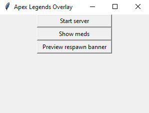
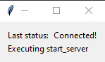
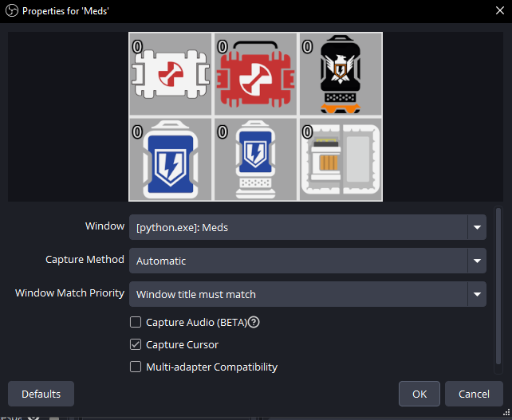
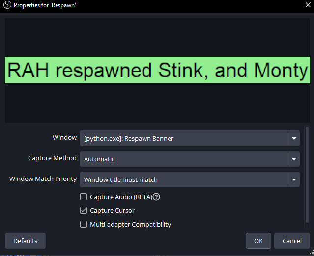

# Apex Overlay

## Installing and setup

The most recent version of the program can be found in Releases on the right side of the page. If Windows yells at you about a security risk there should be an option to see more details and/or run anyways.

The exe runs on its own so you shouldn't need to install anything.

In order to use this you must be running apex on the same computer that is running on and have the liveapi enabled.

### Enabling the LiveAPI

#### Launch args

Right click the game in your library and then click properties. You'll see a box that says "Launch properties," copy and paste the following bit into that box.

`+cl_liveapi_enabled 1 +cl_liveapi_use_protobuf 0 +cl_liveapi_ws_servers "ws://127.0.0.1:7777"`

#### Config file

If you already have a lot of launch args you may need to use the config file for the liveapi specifics.

To use the config file you need to include `+cl_liveapi_enabled 1` in your lauch options

A config file with what you need is included in the releases. Place the file in the following folder (it doesn't matter where your game is installed, it reads from here).

c:/Users/\<User>/Saved Games/Respawn/Apex/assets/temp/live_api/

## Running the overlay

Running the program has 3 options. Customization options are coming soon :tm:

### Start server

This should be pressed before you launch the game but sometimes it works if you do it while the game is running.

When it first starts a new small window will pop up that says "Serving on port 7777".

When it connects to the game the text will change to say "Connected!" Like so:

You can minimize this window but can't close it. It will close and shut everything down when you close the main window.

### Overlay Items

#### Show meds

This window updates about 10 times a second so there could be some latency if you swap views too quickly.

You have to keep this window open in order for it to stay on stream.

When you select the Window Capture in OBS you need to select "Window title must match" or it can cause issues with the other windows.

#### Preview respawn banner

This is just to display a placeholder window so you can capture it in OBS. You should close it before you start the game. Once you have OBS set to capture it you won't ever need to press this again.

While the game is running the program will create and destroy this window as it needs. Like the meds window you need to select "Window title must match." This is especially important for this window so that OBS can pick it up when a new one is made. The auto-made windows will go away after ~5 seconds

